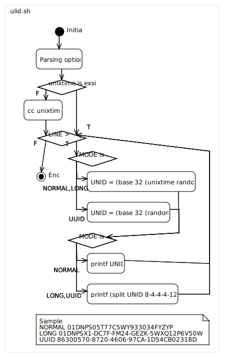
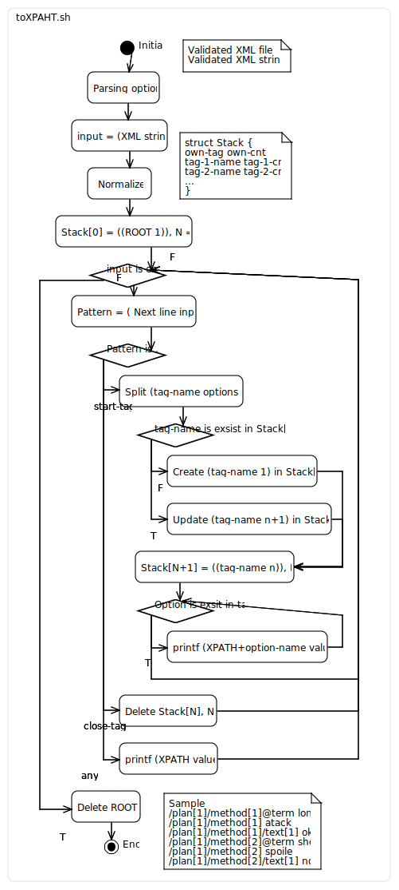

# Shell Scripts On Gist

My shell-scripts collection on Gist.
There are based in POSIX as much as possible.

# LICENSE

This repository is [CC0(Public domain)](https://creativecommons.org/publicdomain/zero/1.0/legalcode).
The License which eatch shell-scripts is based on itselves.

# List

- ulid.sh
  + Generating [ULID](https://github.com/ulid/spec).
  + ulid design is .
- toXPATH.sh
  + WIP. Exchanging format to (like) XPATH from validated XML.
  + toXPATH design is .
