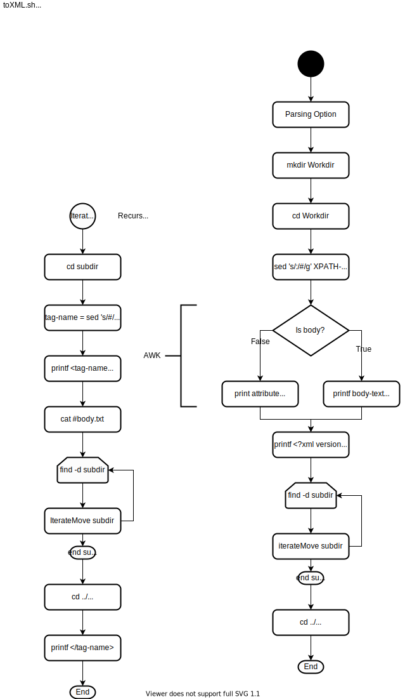

# toXML.sh

- [Overview](#overview)
- [Flowchart](#flowchart)
- [Reuirement](#requirement)
- [Usage](#usage)
- [License](#license)
- [Author](#author)

## Overview

Run `$> ./toXML.sh -h`

Converting format from (like) XPATH to XML.

Shell script source-code is [gist(github) toXML.sh](https://gist.github.com/search?q=user%3Atd-shi+filename%3A.sh+toXML) .

## Flowchart

[](https://www.draw.io/#Htd-shi%2FShellScriptsOnGist%2FUpdateImagesSVG%2FtoXML%2FtoXML-flow.svg)

## Requirement

- Only POSIX command.

## Usage

The [sample.xml](./sample.xml) is [shiporder.xml](https://www.w3schools.com/xml/schema_example.asp) .
The [toXPATH.sh](https://gist.github.com/search?q=user%3Atd-shi+filename%3A.sh+toXPATH) is made by me.

```
$> toXPATH.sh sample.xml | toXML.sh
    <?xml version="1.0"?>
    <shiporder orderid="889923" xmlns:xsi="http://www.w3.org/2001/XMLSchema-instance" xsi:noNamespaceSchemaLocation="shiporder.xsd">
    <item>
    <note>
    Special Edition
    </note>
    <price>
    10.90
    </price>
    <title>
    Empire Burlesque
    </title>
    </item>
    <item>
    <price>
    9.90
    </price>
    <title>
    Hide your heart
    </title>
    </item>
    <orderperson>
    John Smith
    </orderperson>
    <shipto>
    <address>
    Langgt 23
    </address>
    <city>
    4000 Stavanger
    </city>
    <country>
    Norway
    </country>
    <name>
    Ola Nordmann
    </name>
    </shipto>
```

## License

- [CC0(Public domain)](https://creativecommons.org/publicdomain/zero/1.0/legalcode)

## Author

2020 [TD](https://github.com/td-shi/)
