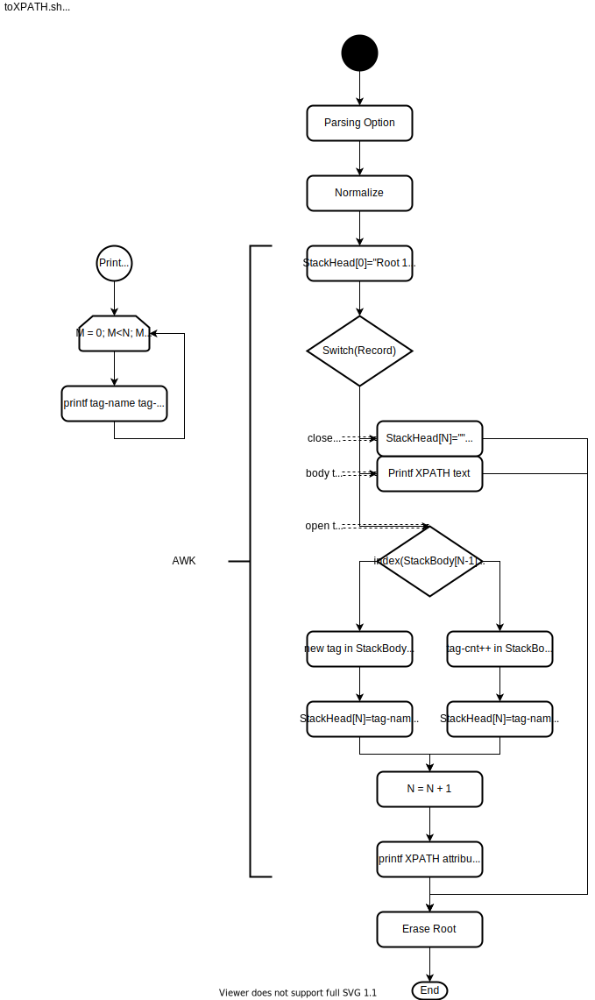

# toXPATH.sh

- [Overview](#overview)
- [Flowchart](#flowchart)
- [Reuirement](#requirement)
- [Usage](#usage)
- [License](#license)
- [Author](#author)

## Overview

Run `$> ./toXPATH.sh -h`

Converting format to (like) XPATH from validated XML.

Shell script source-code is [gist(github) toXPATH.sh](https://gist.github.com/search?q=user%3Atd-shi+filename%3A.sh+toXPATH) .

## Flowchart

[](https://www.draw.io/#Htd-shi%2FShellScriptsOnGist%2FUpdateImagesSVG%2FtoXPATH%2FtoXPATH-flow.svg)

## Requirement

- Only POSIX command.

## Usage

The [sample.xml](./sample.xml) is [shiporder.xml](https://www.w3schools.com/xml/schema_example.asp) .

```
$> cat sample.xml | toXPATH.sh
/shiporder[1]@orderid 889923
/shiporder[1]@xmlns:xsi http://www.w3.org/2001/XMLSchema-instance
/shiporder[1]@xsi:noNamespaceSchemaLocation shiporder.xsd
/shiporder[1]/orderperson[1] John Smith
/shiporder[1]/shipto[1]/name[1] Ola Nordmann
/shiporder[1]/shipto[1]/address[1] Langgt 23
/shiporder[1]/shipto[1]/city[1] 4000 Stavanger
/shiporder[1]/shipto[1]/country[1] Norway
/shiporder[1]/item[1]/title[1] Empire Burlesque
/shiporder[1]/item[1]/note[1] Special Edition
/shiporder[1]/item[1]/price[1] 10.90
/shiporder[1]/item[2]/title[1] Hide your heart
/shiporder[1]/item[2]/price[1] 9.90
```

## License

- [CC0(Public domain)](https://creativecommons.org/publicdomain/zero/1.0/legalcode)

## Author

2020 [TD](https://github.com/td-shi/)
