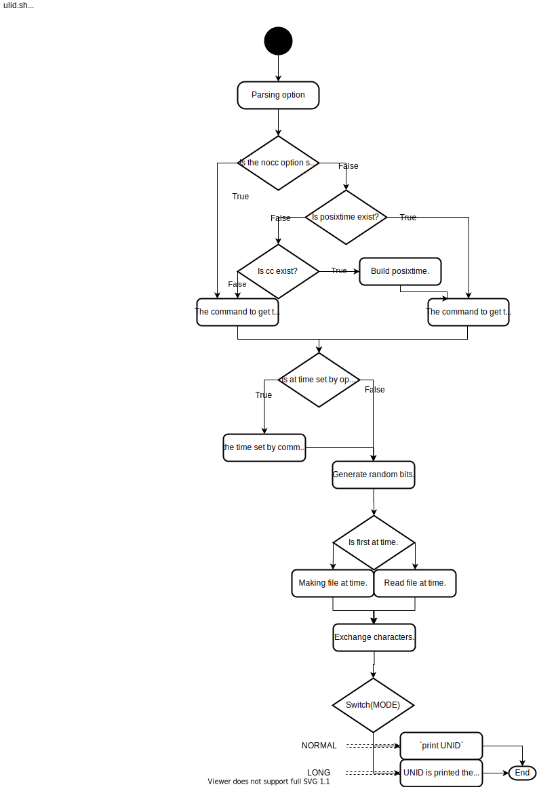

# ulid.sh

- [Overview](#overview)
- [Flowchart](#flowchart)
- [Reuirement](#requirement)
- [Usage](#usage)
- [License](#license)
- [Author](#author)

## Overview

Run `$> ./ulid.sh -h`

Shell script source-code is [gist(github) ulid.sh](https://gist.github.com/search?q=user%3Atd-shi+filename%3A.sh+ulid) .

[Standard reference source ULID](https://github.com/ulid/spec) .

## Flowchart

[](https://www.draw.io/#Htd-shi%2FShellScriptsOnGist%2FUpdateImagesSVG%2Fulid%2Fulid-flow.svg)

## Requirement

- `/dev/urandom` (Linux random device)
- cc (shell POSIX command.)

## Usage

```
$> ulid.sh
01DNPS05T77C5WY933034FYZYP
$> ulid.sh -N 3 -l
01DNPSX1-DC7F-FM24-GEZK-5WXQ12P6V50W
$> ulid.sh -u
86300570-8720-4606-97CA-1D54CB02318D
```

## License

- [CC0(Public domain)](https://creativecommons.org/publicdomain/zero/1.0/legalcode)

## Author

2020 [TD](https://github.com/td-shi/)
