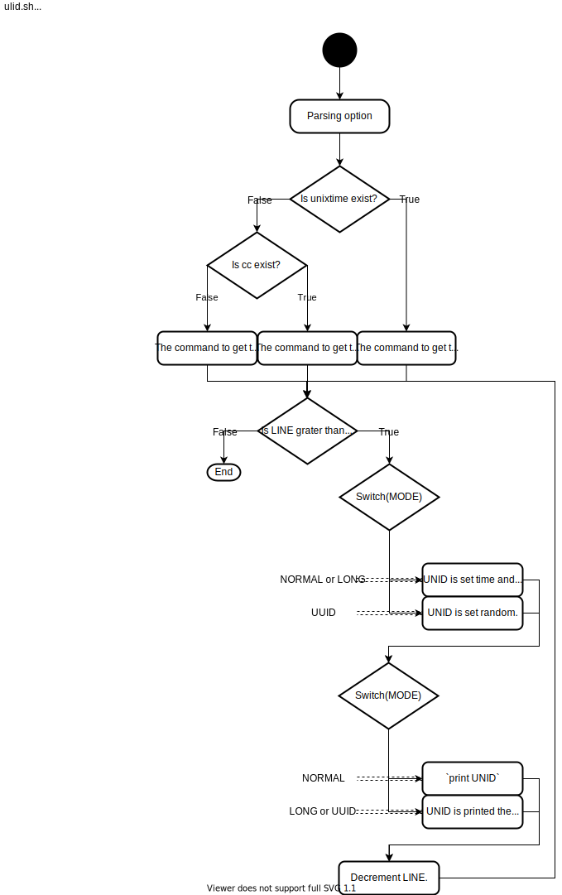

# Template-EPUB3

## Overview

Run `$> ./ulid.sh -h`

[](https://www.draw.io/#Htd-shi%2FShellScriptsOnGist%2FUpdateImagesSVG%2Fulid_design%2Fulid-flow.svg)

## Requirement

- `/dev/urandom` (Linux random device)
- cc (shell command.)

## Usage shell script

```
$> ulid.sh
   01DNPS05T77C5WY933034FYZYP
$> ulid.sh -N 3 -l
   01DNPSX1-DC7F-FM24-GEZK-5WXQ12P6V50W
$> ulid.sh -u
   86300570-8720-4606-97CA-1D54CB02318D
```

## License

- [CC0(Public domain)](https://creativecommons.org/publicdomain/zero/1.0/legalcode)

## Author

[ms-td](https://github.com/ms-td/)
